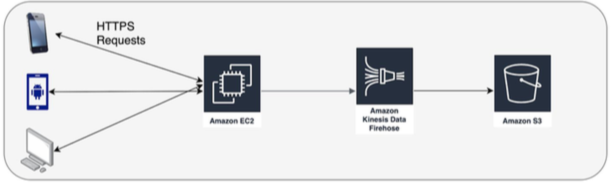
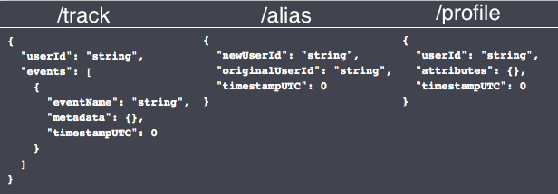

# HTTP api that writes raw data to a data lake in AWS S3 using AWS Kinesis Firehose

## Architecture
This portion of the architecture allows for a client to collect their users data in a cost-effective way that does not require sharing the data with or locking yourself into a 3rd party.

The HTTP server was build in Flask and uses marshmallow schemas for post-requests validation.
The application is running in a docker container. 



## API endpoints

1. **/track** - POST - Log events related to a particular user
2. **/alias** - POST - Assiciate different identifiers to the same entity
3. **/profile** - POST - Save profile attributes for a particular user.

## Post requests structure




## Code architecture
1. **main.py** - the main application logic. Creates a flask api with the required end-points and the logic for post-requests processing.
2. **src/validation_schemas.py** - marshmallow schemas for post-requests structure validation.
3. **test.py** - tests. Sends post-requests with a set of jsons that need to return a status code. Validates whether the status code is correct.
4. **docker-compose.yml** - docker-compose file
5. **Dockerfile** - docker file

## Prerequisites:
1. An environment with permissions to access AWS Firehose. If you're using an EC2 instance, you can create an AMI role and attach it to the instance. The required policies are: AmazonS3FullAccess,  AmazonKinesisFirehoseFullAccess.
2. docker, docker-compose, AWS CLI installed.
3. AWS S3 bucket created.Default name = "***REMOVED***", can be changed in main.py
4. AWS Firehose delivery streams to the S3 bucker described above with an AMI role that has access to S3 created. Default names are: "log_user_events", "link_users", "user_profiles". They can be changed in the main.py

## Execution instructions
Execute the following commands to start a docker-container. The application will start automatically on 0.0.0.0:5000:
```
docker-compose build
docker-compose up
```
## Tests instructions
1. Make sure that the application is running in the docker container on **0.0.0.0:5000**
2. execute the following command to test the application:
`python3 test.py`
